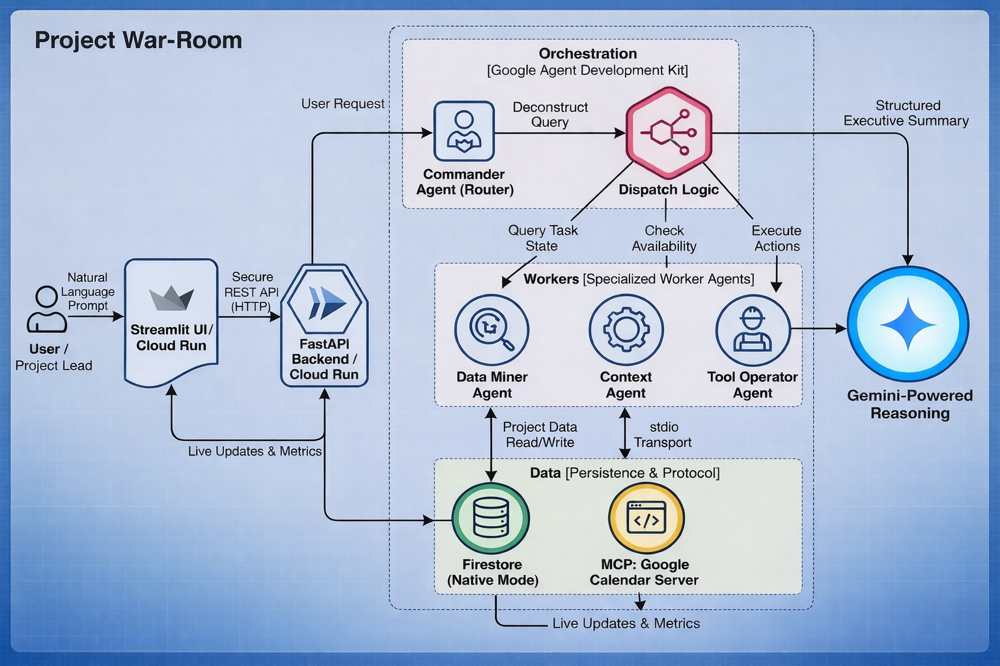
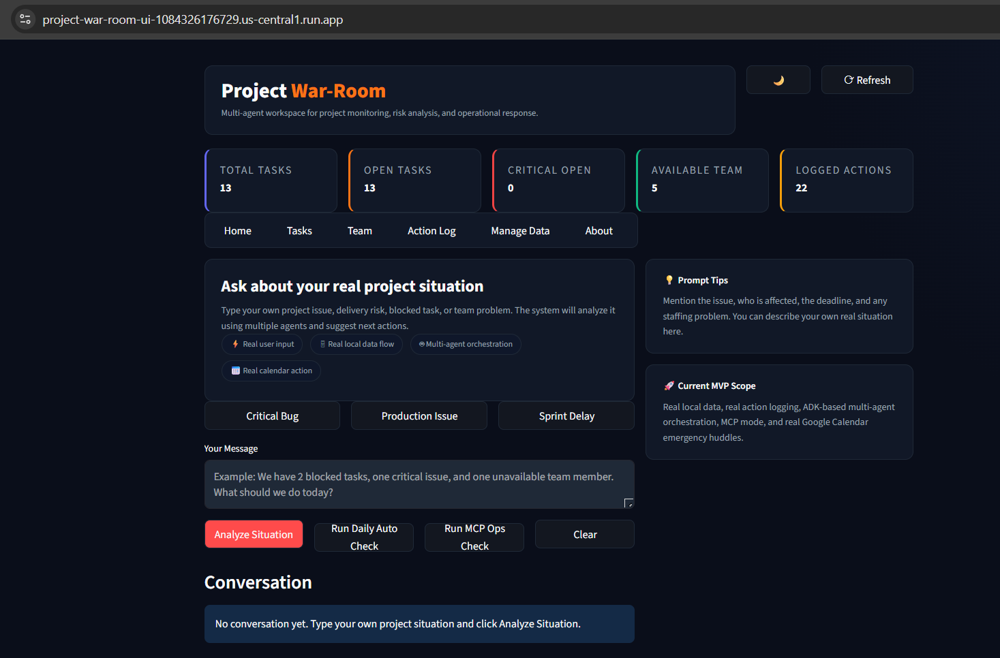

# 🚀 Project War-Room
### AI-Powered Multi-Agent Project Operations Platform

**Project War-Room** is a high-fidelity AI command center designed to eliminate the "30% status-gathering tax" faced by project leads. Built on the **Google ADK (Agent Development Kit)**, the platform transforms fragmented signals into actionable operational intelligence using a **Router-Worker agentic design pattern**.

---

## 🏗 Key Innovation: MCP Tool Integration
To bridge the gap between "Project Data" and "Real-World Time," Project War-Room implements the **Model Context Protocol (MCP)** for cross-tool coordination:

* **Google Calendar MCP Integration:** The **Context Agent** factors in team availability and "Out of Office" (OOO) status when evaluating task delays.
* **Concrete Tool Execution:** The system uses `google_calendar_list_events` to identify scheduling conflicts before the **Commander Agent** proposes a recovery plan.
* **Extensible Architecture:** Designed to support `stdio` transport, allowing for rapid integration of Jira, GitHub, or Slack MCP servers.

---

## 🤖 Multi-Agent Architecture (Google ADK)
We move beyond simple chatbots by using specialized agents to handle complex, multi-step workflows:

* **Commander Agent (Router):** The central brain (Gemini 1.5) that parses natural language intent and dispatches sub-tasks.
* **Data Miner Agent (Worker):** Executes structured queries against **Firestore (Native Mode)** to retrieve real-time task state and priorities.
* **Context Agent (Worker):** Layers operational logic and external context (via MCP) over raw data to ground responses in reality.
* **Tool Operator Agent (Worker):** Manages the execution of protocol-based workflows and external tool-based operational steps.

---

## 📈 Architecture & Workflow
Project War-Room is built on a decoupled, event-driven architecture optimized for **Google Cloud**.


**The Workflow Logic:**
1.  **Ingress:** The user submits a project query via the **Streamlit** frontend to a secure **FastAPI** endpoint on **Cloud Run**.
2.  **Orchestration:** The **Commander Agent** (Google ADK) acts as the primary router, deconstructing the query into specialized sub-tasks.
3.  **Data Retrieval:** The **Data Miner** performs a targeted lookup in **Firestore (Native Mode)** for task metadata and blockers.
4.  **External Context:** The **Context Agent** uses the **Model Context Protocol (MCP)** to pull live availability from **Google Calendar**.
5.  **Synthesis:** **Gemini** processes the combined data (Firestore + MCP) to perform cross-agent reasoning and generate a high-density "War-Room" briefing.
6.  **Actionable Output:** Results and agent activity logs are streamed back to the UI for full auditability.

---

## 🛡 Cloud-Native Security & Scalability
* **Identity & Access Management (IAM):** Uses Google Cloud IAM service accounts for **keyless authentication** between Cloud Run and Firestore, adhering to the **Principle of Least Privilege (PoLP)**.
* **Serverless Scaling:** Deployed on **Google Cloud Run**, ensuring the backend scales horizontally based on demand.
* **Secure Configuration:** Secrets and environment variables are managed via the Google Cloud ecosystem, with a roadmap for **Secret Manager** integration.

---

## 🚀 Getting Started

### Run Locally
```bash
# Clone and enter the repo
git clone https://github.com/Rex123-hash/agentic-war-room.git && cd project-war-room

# Install dependencies
pip install -r requirements.txt

# Start the Backend
uvicorn main:app --reload

# Start the Frontend (In a New Terminal)
streamlit run app.py
```

### Deploy to Google Cloud Run
```bash
# Build and Push to Artifact Registry
gcloud builds submit --tag gcr.io/agentic-war-room-492207/war-room-backend

# Deploy Backend
gcloud run deploy war-room-backend --image gcr.io/agentic-war-room-492207/war-room-backend --platform managed --allow-unauthenticated
```


---

## ⚖ Judging Alignment (APAC 2026 Criteria)
| Criterion                | Project War-Room Implementation                                                |
| :----------------------- | :----------------------------------------------------------------------------- |
| **Technical Execution**  | Advanced use of **Google ADK** for multi-agent coordination.                   |
| **Innovation (MCP)**     | First-class **Model Context Protocol** integration for real-world tool use.    |
| **Architecture**         | Secure, decoupled stack: **Streamlit + FastAPI + Firestore (Native Mode)**.    |
| **Feasibility**          | Fully functional prototype deployed on **Cloud Run** with **Cloud Build**.     |
| **Problem-Solution Fit** | Directly automates the manual "status-gathering tax" for Engineering Managers. |

---

## 🧰 Tech Stack
* **Intelligence:** Gemini (via Google AI / Vertex AI integration)
* **Orchestration:** Google ADK (Agent Development Kit)
* **Database:** Google Firestore (Native Mode)
* **Compute:** Google Cloud Run (Containerized via Docker)
* **Protocol:** Model Context Protocol (MCP)
* **CI/CD:** Google Cloud Build

---

## **Team**
-Built collaboratively by:
1. Amaan Khan
2. Srishti Rathi


### **Submission Note for Judges:**
This project focuses on the intersection of agentic reasoning and operational data. It demonstrates how AI can move from a simple chat interface to a proactive decision-support layer by securely interacting with project management tools and calendars via standardized protocols.